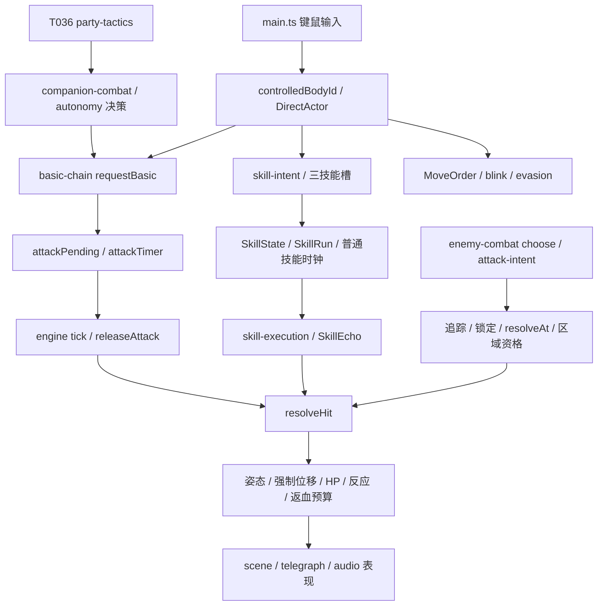

# AR01：主战斗真实调用链

基准：main@dfe16b4；2026-10-07。以下为 **MAIN IMPLEMENTED**，不是未来接口。审计仅覆盖任务指定切片，未扫描全部源码。路径相对于仓库根。

## 控制与请求

输入权威在 `game/src/core/direct-control.ts:42` 的 switchControlledBody；exploration-control 的 directActor 查 controlledBodyId，commandFocus 返回 null。T035 后历史双焦点字段不再构成另一实控权威。切换取消未确认 Aim/输入缓存、转交方向；已接受动作和订单按原契约继续。不能把 Lab 切角色重置世界的行为搬入这里。

T036 的 `party-tactics.ts` 校验 issuer/recipient/requestId/controlRevision，并选择集合、集火、保守、自由。`companion-combat.ts:72` 根据风险、目标、路线和离手状态决策；本身不建立另一 HP 结算器。engine 的自动普攻分支向 requestBasic 提供 companion-ai/order-auto 来源；移动避险请求原 blink/evadeAI。策略与执行已有分界，应保留。

## Basic：请求成功不总是开始动作

`basic-chain.ts:37` 校验实控/AI 来源、角色资格、有限 aim、请求身份与目标，忙碌时允许短缓存。`start`（:25）才推进阶段、取消被接受的玩家普攻所覆盖的 MoveOrder、设置 attackPending 和 attackTimer。当前 BASIC_PROFILES 实际只有 default 两阶段；职业查询接口存在，并不代表已经有不同角色的完整动作拓扑。

engine tick 在剩余前摇归零时记录 basicRelease。此记录在挥空时也产生；随后重新检查目标与 canHit，合格才 releaseAttack（`engine.ts:842`）。releaseAttack 负责现有耐久、计数、攻击威力、镰扫/狙击分支及 poison 等；失败路径不可为了统一事件而提前执行这些副作用。后续 ActionAccepted 应挂 start，而非 requestBasic 返回 ok；AttackEvent 应挂真实释放机会，Damage 仍走原分支。

`exploration.ts:57` 的 attackCommit 只负责探索交战上下文/计时刷新，不是通用攻击事件；不能改名包装后声称装备和成长已经可以订阅所有出手。

## Skill：已有独立槽和多类执行路径

`skill-intent.ts` 已有 InputStyle、目标定义、AimSession、槽/技能/职业身份及确认时再校验。当前生产定义主要仍是 self/instant/toggle/auto；类型支持方向/点/单位不等于已迁移新角色技能。T035 后 command Aim 入口停用，不借新 Runtime 恢复。

`skill-slots.ts` 保留三个独立 SkillState 与 foregroundSkill。engine skill 分支验证并启动普通技能时钟、模式开关或 castSpecial；`skill-execution.ts:26` 的 newRun 已保存 id、spec、weapon、power、origin、heading 和时钟。此为动作上下文基础，但没有统一 root/parent/request/source 链。

`skill-execution.ts:44` 的 echo 保存 caster、castId、快照、延迟与命中集合；tickEchoes（:86）按每类规则执行，部分效果可以与原身体动作分离。rain 有离散槽调度和移动跳槽，镰扫/狙击走普攻派生路径。不是所有技能都经 newRun；普通 engine skill 仍有自己的 pressureCastId。迁移必须逐条适配，不能只改 newRun 宣称全覆盖。

## Mobility / 防御 / 资源

`personal.ts` 已有猎人特殊 blink：端点查询、次数/恢复、动作中断；`evasion.ts` 有伙伴时长移动、扫掠碰撞、次数和无敌源。两者本来就不同，计划中的“全是 generic evasion”需按实际代码修正。

`Unit.block` 表示交战阻挡容量，不是按住盾牌的方向格挡。主战斗已有 brace、ward/shield、主动无敌和 damage defense；尚无 Lab 式通用可选 Block Capability。资源散布在个人次数、SkillState、武器耐久、状态及返血预算中，不应无条件替换成霜寒/弹夹。

## 敌人、空间与投射物

`enemy-combat.ts` 继续负责 kit、资格、冷却与反应；`attack-intent.ts` 缓存源/目标/区域/武器，限制转向，锁定后在 resolveAt 以 intentTargets 判真实区域和空间资格，再进入 resolveHit。telegraph 显示同一 intent 的追踪/锁定区域。

目前 GameState 无独立 projectiles 集合。engine 的 ranged/shot 和 scene 的 shot FX 多是区域/命中后视觉；rain 也直接调用 hit。不能把一条飞行特效线当成有独立扫掠碰撞、死亡后存续的投射物。Lab 的移动运输/落地爆炸是未来适配需求，不是主游戏已实现同类引擎。

## 命中与副作用的关键边界

`engine.ts:88` resolveHit：有效目标 → 显式 eventId 去重 → 主动无敌 → 方向判定/交战 → 随机闪避 → 姿态/Break/位移 → combatEvents → 防御/ward/hurt → 反应/返血/击杀。DoT 等直接 hurt 路径不等价于新的动作出手。

- explicitHits 是按 GameState 的 Set<number>，显式 eventId 先于无敌和随机闪避消费；不是 entity×target 去重。未来多目标事件不能复用同一个现有 eventId。
- combatEvents 记录 source/target/cast/skill/derived/power 等，发生在最终 HP 变化前；缺完整 request/action/root/parent。
- resolveHit 返回 true 可伴随 HP 损失 0，姿态仍可能有效。不可将它解释为正伤害 EffectiveHit。
- `pressure.ts` 的 recoveryBudgets 是 actor+castId 返血预算；不能与普通接触去重、装备出手门或成长首次门合并。
- 中断规则已经存在于 staggerAction、interruptSkill、evasion 和 echo 类型；缺的是统一可追溯取消作用域，不是当前“完全没有取消”。

## 表现权威

`main.ts` update 驱动 scene 和 audio。`view/scene.ts` 读 attackIntent/attackPending/basicRelease 和 effects；`audio.ts` 对 basicRelease 去重发声，挥空也能发声。HP 差值和 damage float 提供受伤反馈。表现有桥接基础但来源分散；未来逐步读事件，不能让动画回调、音效或 FX 决定伤害，也不能用更换桥接重调当前节奏。
