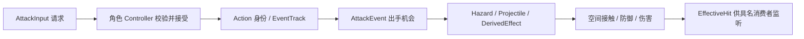

# AR01：Action Lab 语义输入

基准 dfe16b4；仅提炼已冻结 AL01–AL04/F01，不扩研究、不迁移页面或参数。**LAB VERIFIED** 指实验运行时和测试成立；不等于原作动态消费者/OBS 闭合，更不等于 MAIN IMPLEMENTED。

## 可复用的语义链

源码在 `game/src/action-lab/runtime/`：kernel.ts 的 AttackInput 使用真实时间 TTL、EventTrack 使用模拟动作时间和世代取消；player-controller.ts 提供角色专属能力；world.ts 的 Action 保存 request/action/root/parent、朝向、各锁和 track。动画事件供时点输入，空间命中与伤害仍由运行时负责。held 自动推进是 Lab 的已批准行为；主游戏一点击一阶段的纯手动 Basic 不跟随改变。

attack-events.ts 发布出手上下文：caster、action/root/parent、槽技能与实际执行技能、装备实例/修订、generation 等。大斧在合格 AttackEvent 消费自己的事件门/CD/费用并提交派生，不等待目标损血。hit-effects.ts 的 EffectiveHit 则带 caster/root/wave/target/damage；energyReturn 只在盾冲正伤害时使用 caster/root/wave 首次门。两种消费身份不能互换。

projectiles.ts 按模拟时间推进实体、扫掠圆碰撞或运输到落点，保留 owner/action/root/generation、命中目标与死亡策略。身体动作结束不自动销毁已经提交的攻击。AL03 的发射前取消不补发；发射后死亡仍保留运输和落地危险；Reset 换世代清空。这里的有限 arena 投影与碰撞半径是 SAMPLE，不是主地图导航/地形标准。

abilities.ts 的 LabDefense 分开无敌来源与方向盾防，resources.ts 按角色保存资源；小黄不因为小蓝有盾防就获得相同防御。players 下不同控制器共享接口，不共享某个角色所有资源。world 仍是有限实验世界和独立 HP 权威，整份复制会制造双重战斗结算。

## 已有冻结成果与状态

| 输入 | 本轮对应来源 | 可以支持的结论 | 不能推断的结论 |
|---|---|---|---|
| AL01/M1–M3 | [契约](../AL-01/AL01-reference-contract.json)、[M3交接](../AL-01/AL01-handoff.md)、[CR05A冻结](../AL-01/AL01-CR05A-r2-freeze.json) | USER APPROVED 的实验参数、M1手感反馈；LAB VERIFIED 请求/锁/攻防/首次门边界 | 所有参数是原作事实；主游戏正式数值 |
| AL02 | [契约](../AL-02/AL02-contract.json)、[冻结](../AL-02/AL02-freeze.json)、[交接](../AL-02/AL02-handoff.md) | 动作替换、冰柱/大斧独立派生、出手扣费与装备监听分离 | 原素材证据自动闭合动态消费者；复制 SAMPLE 几何 |
| AL03 | [契约](../AL-03/AL03-contract.md)、[冻结](../AL-03/freeze-manifest.json)、[交接](../AL-03/handoff.md) | 骷髅弓接受/发射/飞行/爆炸与死亡存续分离，双敌回归 | 原作最终伤害、OBS、全部 AI 行为均已验证 |
| AL04 | [角色契约](../AL-04/AL04-character-contract.md)、[冻结](../AL-04/AL04-freeze.json)、[架构对照](../AL-04/AL04-architecture-comparison.md) | 第二角色独立 Controller/资源/主动/移动；批准的限定 SAMPLE | 小黄=猎人、小蓝=某伙伴；所有动作最终验收 |
| F01 | [冻结](../AL-04/AL04-F01-freeze.json)、[验证](../AL-04/AL04-F01-validation.md) | 实现/自动回归；默认炮弹速度与射程有具名资源证据，槽/执行身份区分 | 最终 cadence/枪声/投射反馈/换弹用户已通过 |

F01 为 **PENDING USER ACCEPTANCE**。原材质/声音/骨架来源与实际运行时消费者分别保留证据，原作实际结果无证据仍为空。AR01 不为父报告旧“未核”重复取证。F01 .4 秒响应是当前实验实现/回归结果，不作为原作动态射速事实或猎人正式值；加特林运行时尚未实施。

这些冻结清单属于各阶段发布快照：AL01/AL02/AL03部分共享文件已被后续获准任务修改，不能将历史哈希与当前 HEAD 的不同自动判成损坏。AR01 以 dfe16b4 的现源码解释真实路径，以阶段契约和冻结记录追溯来源；AL03 userPlaytest、AL04 userAL04Acceptance、F01 userF01Acceptance 仍未在相应清单中记为通过。M1手感通过不替这些后续门代签。

## 五项规则不能合并

| 规则 | 当前 Lab 门 | AR01 要保留的区别 |
|---|---|---|
| 普通伤害去重 | 波次/实体与实际目标 | 是接触消费，不是角色成长总门；无敌接触的消费时机按当前契约 |
| 成长首次门 | caster/root/wave + 合格正伤害 | 多目标不能多返，来源角色不能串资源 |
| 扣费 | 具名动作释放、装备事件或发射节点 | 请求不等于支付；取消前后退款不能通用化 |
| 施法身份 | caster/action/root/parent/slot/executed | 派生/运输/落地爆炸不得冒充根技能或当前实控角色 |
| 取消清理 | 身体 / 待提交 / 已提交 / generation | 切人不是 Reset；身体结束不是所有效果结束 |

LAB VERIFIED 的这些边界是吸收依据，未来实现仍要服从主游戏当前规则。计划明确采纳语义分离原则（USER APPROVED）；具体生产接口、角色能力与数值仍是 AI RECOMMENDED / PENDING。
