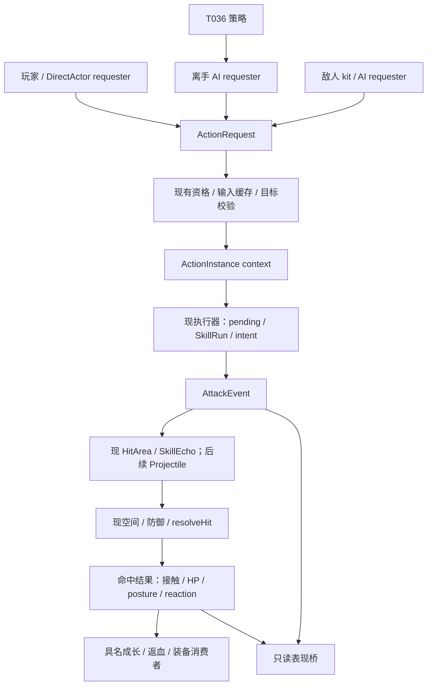

# AR01：最小目标架构

状态：语义分离与保留 T035/T036 为 USER APPROVED；下列生产接口和迁移接法为 AI RECOMMENDED，尚未实现。本轮不增代码、不立第二战斗核心。

## 接口职责

ActionRequest 保存 actor、requester、请求身份与能力/目标；权限仍由原 controlledBodyId、原 AI/order gate 和 skill-intent 校验。ActionInstance context 在真实接受时保存 action/root/parent/source actor、slot 与 executed ability、模拟时间、规则/配置版本及 request 来源，不由当前实控角色倒推施法者。

攻击权限与移动权限属于动作执行能力，允许独立变化；AR02 仅观察原 gate，不改变它们。取消理由和作用域属于具名动作/效果：未接受请求、身体、待提交、已提交危险、世界重置分开。切换 DirectActor 只换下一请求者；现已接受动作/订单继续契约不变。未来实体死亡存续由规则决定，不能默认复制 AL03 的所有死亡策略。

AttackEvent 是一次真实出手机会，可挥空，不负责直接扣 HP。需要 event/action/root/parent/source、executed/slot、wave/entity 与派生标签；不能复用交战上下文 attackCommit 来冒充。EffectiveHit/HitOutcome 是空间接触经过当前规避规则后的结果，应显式包含 hpLost、postureApplied、防御/反应事实。正伤害成长、返血预算、接触去重和装备出手门各有独立消费键。AR02 不启用新装备监听器或重接现成长。

## 生产挂接位置

| 现位置 | 最小挂接 | 保留责任 |
|---|---|---|
| basic-chain.start | 实际接受的 context，附 pending | 来源/缓存/手动请求/订单/阶段资格 |
| engine 普攻释放分支 | 挥空与命中前的只读 AttackEvent | 原 timing、目标重检、releaseAttack 副作用 |
| engine skill 成功启动 + skill-execution.newRun | 按路径关联 context；模式开关不假造伤害 | 槽/资格、CD、计数、模式与 spec 快照 |
| SkillEcho 提交和 tick | 父/根追溯，保持现延迟及 detached | 不修改已提交效果存续或 source 快照 |
| engine.resolveHit | 保留原结算并记录分项 outcome | 随机、eventId、shield、姿态/位移/返血 |
| enemy attack-intent | 后续观察 accepted/locked/released | kit/eligibility/Telegraph/区域资格 |
| personal / evasion | 后续 MobilityCapability 查询适配 | 现端点、扫掠碰撞、次数/恢复、无敌 |
| scene / audio | 后续渐进桥接，只读消费 | 原视觉/音效，不变更 timing 或伤害 |

角色层未来挂 profession/unit 定义 → CharacterCombatProfile → CharacterCombatController → 共享接受/执行接口。能力包含 BasicDefinition、AbilityDefinition、可选 ResourceCapability[]、MobilityCapability、DefenseCapability[]；不以 hunter/partner 两个 if 堆满所有能力，也不把小蓝/小黄绑定为正式角色。

ResourceCapability 的 canPay 必须只读，pay 在具名接受/释放节点，gain 有自己资格，resourceChanged 供表现；底层适配现角色资源，不向 Unit 添加每个新资源字段。正式费用/恢复/退款规则待后续任务。`behaviorTags/aiPermission/setupTags/payoffTags` 仅作为未来 AbilityDefinition 预留概念，不实施 EC11 自动协作。

## 共用执行而不共用策略

玩家、离手伙伴和敌人可提出同结构请求，各自 eligibility 与 AI 选项不同。T036 改目标、路线、风险权重和 AI 请求机会；不得修改伤害、锁时点、资源支付或已提交效果。敌人 kit 不必实现 PlayerController；共享的是身份/事件和执行能力边界，不是强制一个全能类。

## 最小第一刀

AR02 只新增旁路身份/事件记录，保留原 pending、SkillRun、resolveHit 权威；不引入新 scheduler，不替换 Basic 动画，不新造 Projectile/资源/盾防。接口做窄：接受、释放、结果、取消记录；不要求 controller 公开所有 Unit 内部字段。新 ID 使用独立计数或稳定派生键，避免污染现 nextId 与 seed；按 GameState 隔离、重置清理、有界日志，不建立模块级跨世界存活监听器。

目标链是之后渐进迁移方向，AR02 完成也不等于已拥有统一角色动作运行时或真实投射物。完整替换的必要性应由每步回归与真实角色需求证明。
