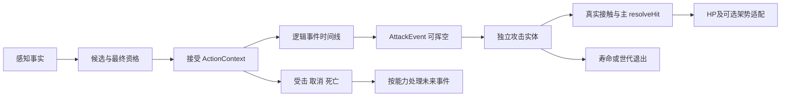

# EN00｜两个最低动作剧本与语义契约

本文件区分“当前Lab事实”与“下一阶段提案”；数字来自已有SOURCE/SAMPLE，不变更已认可玩家手感。[来源](EN00-reference-evidence.md)。主探索尚未实施。怪物attack无原Break/End事件；AttackReady、MoveReady必须独立记录为实际消费者/显式SAMPLE，不从小蓝a1–a4继承。

## 僵尸最低剧本

| 顺序/相对时点 | 身体/判定/表现 | 证据类别与拒绝/退出 |
|---|---|---|
| Sense→Candidate | 原静态最近目标/范围门；Lab只面对玩家 | 真实双人/LOS/归位须新适配，不读隐藏玩家目标 |
| FinalReady→Accept t0 | dead/disabled、action/hurt、CD、范围、35°逐项检查；接受分配根ID，缓存方向；设CD1.5 | Lab SAMPLE；候选通过但最终角不合格时无Action/Attack/扣费 |
| Flash/Lock t0 | 原attack事件；锁缓存方向的实现是Lab适配；画面attack开始 | SOURCE时间；提示形态/镜像/音效绑定SAMPLE，不称原预警持续长度 |
| Dash t.5667 | 按.7/.2推进，真实障碍裁切运动 | SOURCE配置、Lab有限墙；墙挡运动不把无敌或挥空删掉 |
| Hit t.5667 | AttackEvent，出生扇区range1.6/halfAngle.8/lifetime.1，随施法者位置；可无目标 | SOURCE事件+SAMPLE几何；**出生不等于HP损失** |
| Contact [.5667,.6667) | 每实体/目标接触一次；玩家闪避/正反架盾/墙/距离；实际结果由resolveHit | Main两身体去重，规避拒绝消费按显式Lab合同；与成长首次门无关 |
| Hurt/Cancel | effective damage/interrupt eligibility严格incoming>defensive；取消未来native事件 | Lab硬直.24/击退.3；位移、普通受击、实际cancel分列 |
| 已出生危险 | Lab身体hurt不自动统一删除enemy危险；死亡清非persistent owner危险，期限也退出 | death与hurt不同，**不套远程retain**；主墙策略EN02验证 |
| AttackReady/MoveReady/Finish | Lab直到2秒track finish恢复；没有native两个解锁事件 | 显式SAMPLE；下一轮可先两门同为finish，但记录独立字段、不可声明原作两秒必恢复 |
| Death/Reset | 停新候选/动作，死姿态；Reset清世代/危险 | 身体死亡、危险死亡策略、世界Reset分别测试 |

声音：原已提取release/hit/hurt录音作为事件绑定实验；release应跟实际逻辑AttackEvent、hit跟实际接触结果，拒绝/挥空不伪造命中声音；表现日志暂停消费/恢复不回放旧音，真实音效评价另待EN06。

## 骷髅弓最低剧本

| 顺序/相对时点 | 当前Lab行为 | 来源与必要边界 |
|---|---|---|
| Sense/Move | 距离不合格靠近/太近后撤；CD期间4–6舒适带 | AI差异SOURCE、具体速度/距离与两人择敌SAMPLE |
| FinalReady→Accept t0 | 单根范围1..9、CD、身体/伤控、最终35°；缓存目标点与方向 | 最终实例值受原属性修正，Lab固定采用SAMPLE；接受后不追玩家 |
| Flash0 | attack表现开始 | SOURCE，string1保留；提示/音效映射未闭合 |
| Hit/Lock .6333 | 一个根AttackEvent请求两个child；Lab预提交3个projectileId，child2一个、child3两个 | SOURCE事件与1+2定义；子模板/Son实际消费者P。须保持root/child/transport身份分别存在 |
| Spawn .6333/.6333/.7333 | 两个立即运输，第三延.1；未到spawnedAt不移动、不绘制、不接触 | 已提交实体独立，Lab第三在未来出生但已预提交；发射后身体cancel不撤回。EN03必须明确保留这项合同，不能误当尚未提交的body event |
| Travel 各.92秒 | 抛物线height3.8，固定终点；运输不直接伤人 | SOURCE定义+SAMPLE采样与真实地图适配；不是飞箭穿过角色扣血 |
| Land 约1.5533/1.6533 | 每运输各自产生爆炸ID/真实圆形危险；半径.8/寿命.1，名义3 | Lab时间/几何SAMPLE；根/子/爆炸来源名不可合并；原Finish async不保证同帧爆炸 |
| ExplosionContact | 每波次/身体独立一次；爆炸中心作为格挡来向，重合用运输逆方向 | 已批准Lab适配；普通伤害去重不按整个root只打一次，也不等于成长首次门 |
| 身体恢复t1.2 | Labfinish，attack/move恢复；与仍在途危险无关 | SAMPLE，不能t1.2自动清在途 |
| Hit前取消 | 阻止未来root Attack，0运输 | 已通过Lab自然Q打断历史测试；不是HP一减就必打断 |
| Hit后取消/死亡 | 所有已预提交运输与爆炸按retain存活，无死后新AI | 已批准SAMPLE/Lab自然击杀验证；不从原动态证据推断 |
| Reset/换代 | 清实体、效果、订阅与旧代延迟出生 | 跨代不靠actorId字符串复用；旧效果不得攻击新世界 |

## 主权威与不合并的语义

1. ActionRequest可拒绝，真正accept才创建ActionContext。AttackEvent可挥空，EffectiveHit/HitOutcome记录真实目标与HP/架势/防御；禁止“Attack成功”等于“已命中”。
2. 普通去重键是generation/具体实体或wave/target；成长首次门是caster/root/wave；每招费用和CD节点各自合同；取消只清该能力规定对象，不做全局root一刀切。
3. 施法者身份取接受时actor/root/parent，不取当前Z主控。Al/Hunter互换不转移敌人危险或支付来源。离手AI用相同命中接口，不因后台身份绕visibility/Encounter。
4. trace off只关诊断，不能关闭动作或伤害；主模拟clock唯一。暂停/slow/Hitstop使用现主clock，不再推进LabWorld。
5. 无敌、方向格挡、HP0、护甲未穿透、Posture削减、普通Hurt、Broken、击退撞墙与真正取消分别记录。保留被拒原因，不能看到不掉血就判闪避成功。
6. 任意未来原作补证与SAMPLE不同应形成差异，先审影响；不无依据改玩家黄金值或把样板伤害当最终平衡。

验收反例：bodyfinish后子弹仍落地；刚发射即死亡仍有3次落地机会；发射前有效打断没有运输；挥空有AttackEvent无HitOutcome；低于min仅本根拒绝，不偷偷改旧近战；traceoff行为一致。
