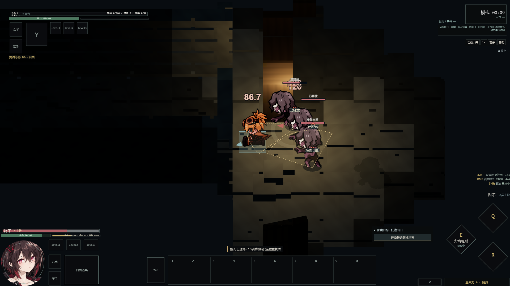
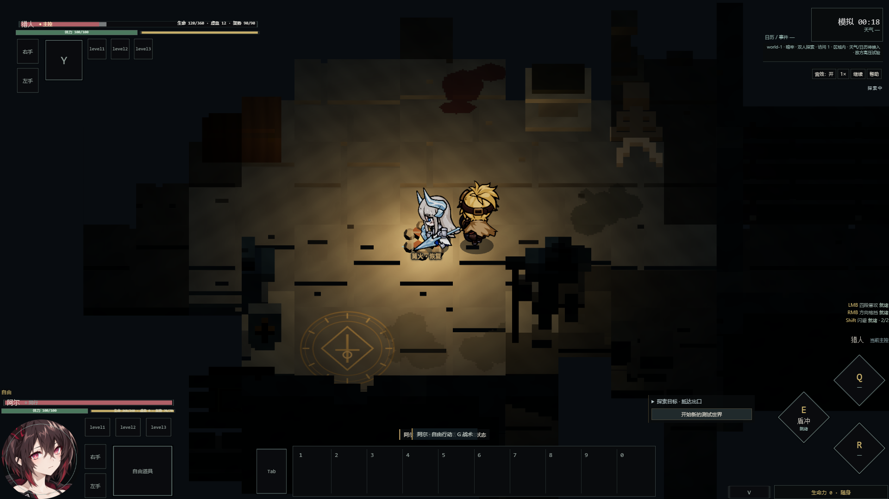

# LT-01 v0.3 定向验证

R：B；L：限定 C（生命、控制输入、体力付款、世界事务跨权威）。按开发细则 v2.2 §7.1.1 做受影响验证，未扩为旧 Tower/四人/全部历史浏览器回归。

| 检查 | 实际结果 |
| --- | --- |
| ROST 减法 | 3 个 RED 后修 roster/default/copy；角色清理定向 5 文件 80 项通过，TypeScript/主构建通过；专属删除 SHA 清单已独立提交1963c6c。 |
| 最终核心 | 8 文件 **108 项通过**：LT11、roster、CB02、AR06、EN06-G01、ENBAL01、EN01 entity、NR world。不是全部旧测试。 |
| 单死/非法点 | 死者拒绝控制/受击/占位；10模拟秒、暂停冻结、阻塞重试；满基本状态与支付对象/ID延续；Al弹药/CD/武器实例保留。 |
| 原子全灭 | 同步双死、短观察阶段、重复致死不重复进入；阻塞不半恢复，互不重叠；同世界代次、已杀怪、收益/机制与实体序号不重置。 |
| 存活者语义 | Al可使用篝火/资源消费者、合法离区/继续；死者不早复活、不补资源。现普通暗牢点只有篝火，resource 使用局部测试定义扩展验证消费者，未新增正式资源点。 |
| 危险/动作 | 已提交未来箭落点覆盖候选时等待；玩家单死不清敌方 retain 实体；幸存Al已接受火箭经过自动交接仍落地一次、不二次扣体力。 |
| 两构建 | 主和 Action Lab 均 TypeScript+Vite 通过；主原有大 chunk warning，未称性能验收。 |

真实键鼠分段：最初 ROST 1条通过；L 首轮3条中2通过1失败；修正实验场景的断言后第二段4条通过。**不把分段说成一次全部通过**。Edge/SwiftShader 1920×1080，自然移动/攻击和实际敌人命中，没有浏览器注入 hurt/血量/生命状态。

1. 默认入口无旧伙伴按钮；实际 Z/F/G 可用、Al原头像在，无 Charlotte/Rina 请求。
2. 靠近敌人、Z切Al、真实右键发射：活体本体 bar/buff 均不可见，敌方活体血条可见。
3. 猎人自然死亡时旧 LMB+D 仍按住：猎人 group/bar/buff 隐藏，Al实控、held/shotHeld/direct无旧转发；暂停钟冻结。随后高压怪物把Al也击倒，world-1不变、wipeCount=1，在entry恢复双人。
4. Al自然死亡→Hunter接手；真实键盘退到入口，等待Al在同伴旁恢复，wipeCount=0，控制仍Hunter。身体恢复正常、无头顶条、固定HUD同步。

失败与修正：首次核心计时按墙钟9.9+.11误判，实际s.time=9.91，命中停顿正确；改为模拟截止断言，未改等待参数。world夹具原未beginWorld已补合法初始世界。核心幸存rocket夹具需先取得Al实控再接受；resource夹具不含资源点，按NR已有方式局部扩展，未改生产地图。首次浏览器结束Hunter实控，是Al后来也死亡触发wipeCount=1；改将该自然情境验为全灭，并新增真实撤离的单死情境，而非放宽产品契约。ROST首次观察器__xinghai错误、shell工作目录重叠报错均为测试操作失败，产品未为它们改造。

证据只冻结本轮必要日志、5张实屏与简短状态JSON，未复制全量历史产物。保护SHA见 validation/protection.json。黄金动作与高压配置/Al头像从cc04ac2保持；世界测试中的旧downed人为夹具仅复现已有隔离契约，不是正式可到达生命流程。

未测：目标GPU性能、长时压力、多层移动地形全部边界、多分辨率整PPT回归、RMB/E在死亡边界的每种物理组合、自然双弓同帧全灭。RMB/E的旧请求清理有代码和核心动作验证，但不冒充逐项真实试玩。SAMPLE时长/返场体感、CB02/ENBAL/UI各用户Gate仍待人工，未代签。
