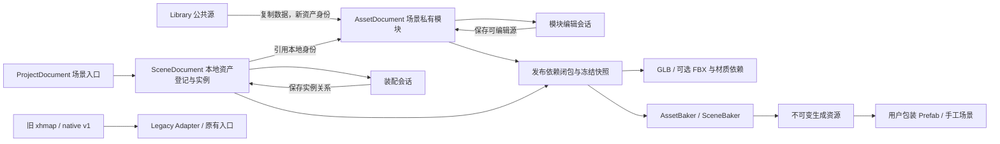

# TOOL-005 工坊四工作区正式重构设计

日期：2026-10-04。状态：**Task1契约、Task2项目事务/IPC和Task3四工作区壳/管理/模块编辑已实施；装配、冻结发布及引擎接线待后续任务。**

用户已确认 [TOOL-004 四工作区 UI](TOOL-004-工坊工作区UI验证.md)，并在本对话授权“执行”下一轮正式重构计划。本文件将确认的工作流转换为推荐的工程设计；新增的字段、存储布局和版本规则是本轮技术方案，不能记成用户此前已经指定的格式。

配套：[实施计划](TOOL-005-工坊重构实施计划.md) · [术语](TOOL-005-工坊术语.md) · [第一轮页面职责与功能迁移](../../自制工具/map_editor/validation/workspace-phase1-prototype/工作流与迁移.md)。规划阶段仅新增文档和核查记录；随后用户授权实施，实际结果记录于[Task1](TOOL-005-Task1-验证.md)、[Task2](TOOL-005-Task2-验证.md)与[Task3](TOOL-005-Task3-验证.md)。Unity插件尚未改动，无提交、推送。

## 1. 依据与实际起点

- 本地 HEAD 为 `7ec8a315e414493a62bd3f355b63a340e1f8cece`，对应 M1.1 历史提交。当前磁盘还包含未提交的 M1.2 / TOOL-003 和其他并行成果；实现时以磁盘有效成果为基线，不恢复到 HEAD 来覆盖它们。本轮未重新查询远端。
- `core/document.ts` 的 `createMap/validateMap/EditorDocument` 同时管理几何、表面逻辑、实例、贴花和编辑辅助。实例须由同一地图的 cells 提供水平支撑；其约束继续适用于 Legacy。
- `core/native-asset.ts` 已有 `xinghai-native-asset-1`、稳定 assetId、局部坐标、anchor、sourceOrigin 和同 ID 更新。`assetToMap` 是纯资产编辑桥接，不是旧地图的无损转换器；它不带 PNG、保护列、表面或实例。
- `desktop/main.cjs` 使用全局 current/nativeCurrent/catalog/dirty；`renderer.ts` 集中处理旧 UI。目录清单提供资产身份，尚无项目、场景私有资产或发布版本登记。
- `core/scene-glb.ts::exportSceneGlb` 仍接收旧地图并调用 validateMap。其静态组合能力可以提取复用，新场景不能伪装成旧地图以绕过支撑校验。
- `SourceReader.Parse` 和 `MapBaker.Bake` 接收旧地图。后者在 `Assets/Generated/<mapId>` 稳定更新资源、保留 GUID，并用 BakeJournal 回滚。它是可变 Legacy 烘焙，与新不可变发布接收分开。
- 既有源码契约为 0.25 米、右手 Z-up；Three/GLB 映射 `(X,Z,-Y)`，团结几何映射 `(X,Z,Y)` 且反转绕序。第一轮 throwaway 视口的简化公式不能移入生产。

现有已验证能力和限制以 `自制工具/map_editor/docs/Validation-M1.2.md` 为准；第一轮 20 项原型检查不能替代生产验收。

## 2. 工作流和技术路线

目标是“制作独立模块 → 组合场景 → 冻结发布 → 引擎接收”。地面、洞壁、崖壁、高台与大小道具均可成为模块；场景保存实例关系，不再持有一份融合后的几何权威。Gameplay 标签、事件、导航和最终碰撞制作归 Unity，旧图仍能通过 Legacy 工作区处理。

| 路线 | 能力与代价 | 本轮选择 |
|---|---|---|
| 保留旧契约，新增项目/模块/场景文档与 Adapter，逐页接线 | 每阶段可回退到 M1.2；要显式维护两种输入路线 | 推荐；下文据此安排 |
| 一次性改写旧地图格式和 MapBaker | 格式统一，但同时触及旧图、事件身份、导出和人工场景 | 不采用；迁移风险集中且难以独立验收 |
| 仅给旧 renderer 加四个标签 | UI 可较快出现，但资产仍属于单张地图、保存与发布混在一起 | 不采用；不能满足场景私有草稿和冻结发布 |



发布快照读取自己的冻结负载；不能在接收时再次去公共库解析“最新 assetId”。

## 3. 文档与最小类型

以下是规划中的字段。所有新稳定 ID 使用 UUID 的 ASCII 字母数字/`_`/`-`交集，不用显示名、目录名或哈希作身份。revision 是可变源事务计数；publishId 才标识不可变发布，两者不互相冒充。

```typescript
import type { EditorMetadata } from "./references.ts";
import type { MaterialColor } from "./palette.ts";

export type Vec3 = [number, number, number]; // 源 X/Y/Z，米
export type Cell = { x: number; y: number; z: number; color: number;
  owner?: "height" | "volume" };
export type MaterialProfile = {
  schema: "xinghai-palette-1"; profileId: string; profileRevision: number;
  paletteId: string; paletteRevision: number; unit: "meters";
  axes: "RH_Z_UP"; gridStep: 0.25; colors: MaterialColor[];
};
export type AssetDocument = {
  schema: "xinghai-workshop-asset-1"; assetId: string; revision: number;
  name: string; voxelSize: 0.25; cells: Cell[]; palette: string[];
  sideColor?: number; materialProfile: MaterialProfile;
  protectedColumns: string[]; editor?: EditorMetadata;
  anchorM: Vec3; rootMode: "grid" | "legacy";
  provenance?: { assetId: string; revision: number };
  legacyNative?: { sourceOriginM: Vec3 };
};
export type SceneAsset =
  | { kind: "voxel"; assetId: string; source: string }
  | { kind: "external"; assetId: string; revision: number; model: string;
      files: string[]; anchorM: Vec3;
      recipe: "glb-rh-y-up" | "blender-fbx-5.1.2" }
  | { kind: "texture"; assetId: string; revision: number; image: string };
export type SceneInstance = {
  instanceId: string; assetId: string; positionM: Vec3;
  rotationDeg: number; groupId: string;
};
export type SceneDocument = {
  schema: "xinghai-workshop-scene-1"; sceneId: string; revision: number;
  name: string; voxelSize: 0.25; assets: SceneAsset[];
  instances: SceneInstance[];
  groups: { groupId: string; name: string; visible: boolean }[];
  decals: { decalId: string; assetId: string; positionM: Vec3;
    rotationDeg: number; widthM: number; heightM: number }[];
};
export type ProjectDocument = {
  schema: "xinghai-workshop-project-1"; projectId: string; revision: number;
  name: string;
  scenes: { sceneId: string; name: string; source: string }[];
};
```

AssetDocument 是新可编辑模块源 `.xhmodule.json`，可保存空草稿、PNG 和保护列，不强制名称、缩略图或发布。`name` 允许空串，UI 用临时名称展示。cells 始终是唯一权威几何；anchorM 是唯一 Root，不再另存一个 pivot 偏移。新建 rootMode=grid；原生 v1 导入保留旧 anchor 和 sourceOrigin，以 legacy 模式维护。兼容读取接受旧 native 合法的带点 assetId，不因新ID生成规则改写旧身份；新副本再使用UUID。

SceneDocument 是 `.xhscene.json`。它的 assets 都归本场景，路径只能在场景目录内；Library 不直接成为场景的可变依赖。geometry 在 AssetDocument 或外部模型中，Scene 不含权威 cells 或 Gameplay。模型实例只引用voxel/external，贴花只引用texture；texture为实际PNG，复制与冻结字节，不当人物参考。外部model是可验证的GLB预览，files包含已有FBX/旁车/贴图，recipe记录其配方；原始未知FBX配方不自动标为受测。分组是美术组织，显隐不决定支撑或玩法。水平美术贴花留在场景；人物比例 PNG 留在模块辅助元数据。发布默认包含隐藏分组，仅在发布检查中明确显示“隐藏不是排除”；本版不添加独立排除标记。

ProjectDocument 是 `.xhproject.json`，只登记场景入口。公共库仍由用户选定目录和 Catalog 管理，所选目录属于桌面配置；可移交的 Project 不写入本机绝对公共库路径。首次不新增数据库、云同步或文件监视自动更新。

### 存储布局

```text
用户选定项目目录/
  project.xhproject.json
  scenes/<sceneId>/scene.xhscene.json
  scenes/<sceneId>/assets/<assetId>.xhmodule.json
  scenes/<sceneId>/external/<assetId>/<模型与必要依赖>
  scenes/<sceneId>/textures/<assetId>.png
  releases/<publishId>/manifest.xhpublish.json
  releases/<publishId>/payload/<冻结源与依赖>
  releases/<publishId>/output/<GLB 与可选 FBX 及材质依赖>
```

Library 可继续包含旧 `.xhasset.json`/GLB/FBX，也支持新的 `.xhmodule.json` 可编辑源。新模块登记公共库时生成新 assetId，成组写入新模块源、GLB 和清单；不把晋升理解成搬走场景源。旧 native v1 仍按旧链路打开/更新，不被自动改成新格式。

### 校验与错误

- 新模块沿用 cells≤250000、坐标绝对值≤8192格、色板1–64、位置/锚点≤2048米、PNG≤32MiB 的现有限制；空草稿可保存，空资产不能发布。
- 新场景沿用实例/贴花各≤10000、身份唯一、90°倍数旋转、不支持 scale、贴花尺寸(0,256]米。源 revision 为0至2147483647，溢出拒绝提交；新发布使用UUID，不依靠无限递增版本。
- 新建 voxel Root 为0.25米格点。旧 native anchor 可以是0.125米或任意历史值，不自动取整。外部资产不伪造体素或反体素化。
- 文档解析拒绝组/身份/路径结构损坏；独立引用检查返回缺失负载、失配身份与不对齐的Issue。加载显示缺失占位并允许修复，发布拒绝这些Issue。装配不调用 Legacy 的实体地形支撑校验；允许创作者暂时悬空摆放。贴花同样按美术变换保存，不静默清除。
- 单文件仍受64MiB保存限制。只在使用文件时读取，不能为了 Project 打开把每个场景和模块都常驻内存；实际负载由验收样本给出，不据此承诺大世界流式性能。
- 文件变更冲突保留内存和磁盘两份版本，用户可另存或重开；错误说明是哪份文档/依赖失效，不返回笼统“保存成功”。

## 4. Root、对齐与更新

源空间变换统一为 `worldPoint = T + Rz(theta) * (localPoint - anchorM)`。绘制视口、实例预览、GLB 与团结接收使用同一源变换，然后各自做轴变换。已减 anchor 的 GLB 以零锚点消费；绝不再减一次。旧 native sourceOrigin 是局部帧来源记录，不是场景平移。

严格体素对齐检查的是 `T - Rz(theta) * anchorM` 各分量是否为0.25米整数倍，容差1e-6米；而不是只检查 Root 世界坐标。旧底面中心 anchor=0.125米时，T 可以带0.125米相位，让体素边界仍落在格线上。吸附使用相同相位规则；旧图不自动吸附或改坐标。

日常增删体素、改色、重新计算包围盒不得重算 Root、局部原点或实例变换。同一场景的多个实例引用同一场景私有模块，保存该模块后一起预览新几何，各自保留原变换。另一场景的独立副本不受影响。

已被引用资产的 Root 修改须显示受影响实例；“保持现有几何世界位置”的重设根为联合命令：`Tnew = Told + R * (anchorNew - anchorOld)`。WorkshopSession保存模块与场景前后快照，给双方历史登记同一commandId；取消/撤销/重做一起同步Root、场景、revision、dirty和视口。若其中一份文档已有后续操作，拒绝跨过它撤销并提示先撤销后续操作，不能覆盖后来的造型。所有UI撤销经会话协调，单文档磁盘事务不能替代此机制。发布过的快照不修改；用户改变可变源 Root 不会回写旧发布。首次没有跨项目自动重设根。

## 5. 独立副本、复制与公共库

| 操作 | 身份与数据处理 | 是否影响原件 |
|---|---|---|
| Library 取用到场景 | 新 assetId；复制全部可编辑字段/外部依赖；provenance记录来源；场景获得自己的源 | 不改变公共原件 |
| 同场景再放置 | 新 instanceId，引用同一local assetId | 修改本地模块会更新本场景这些实例预览 |
| 复制实例 | 新 instanceId；保持assetId、Root和旋转；位置由显式移动决定 | 原实例不改 |
| 复制本地模块 | 新 assetId，深拷贝几何/参考/Root/材质 | 原模块不改 |
| 草稿登记公共库 | 新library assetId，复制源；场景源继续私有 | 不搬走、不重定向已有实例 |
| 复制场景 | 新sceneId、新本地assetId和instanceId，重映射引用并复制文件 | 原场景不改 |

复制可编辑资产将源revision重置为0，以provenance记录来源assetId/revision；保留 profileId/colorId 的语义来源，为独立色板创建新 paletteId 并将 paletteRevision 重置为1，否则同色板身份可能出现不同内容。数组、PNG引用字段、Root与材质快照均深拷贝。只读材质内容可在渲染缓存共享，不得共享可变对象。

外部 GLB/FBX 源复制包括必要旁车/贴图，保留源配方和根转换，不承诺任意网格可反体素编辑。直接链接公共库及批量追随最新版本留后续扩展，本版没有默认动态链接模式。

## 6. 四工作区接线与 Legacy

- 新增 `desktop/workshop.html` 与独立入口，在各阶段通过 `--workspace=workshop` 进入，旧回放明确`--workspace=legacy`。旧 `desktop/index.html/renderer.ts` 保持可运行；完成整体验收后再切换默认入口，随时能回到 Legacy。main的IPC来源检查绑定本次实际打开入口的规范化URL，不通过允许任意file URL来兼容新页。
- 会话注册保存当前Project、Scene及已打开模块。每份源有自己的 dirty、撤销栈、保存哈希和视口状态。切页不保存、不重新打开、不清空撤销；跨场景先处理未完成笔画，关闭窗口汇总未保存源。
- 模块制作通过 Adapter 调用现有 EditorDocument 的体素/笔刷事务、palette/references/mesher；输入不带实例/Gameplay，输出完整写回新模块字段，不能拿临时mapId替代assetId或材质身份。
- 场景装配使用独立 SceneSession；移动/旋转/复制/删除/分组/框选为可撤销场景事务。PNG不进入实例拾取；拖拽中Esc恢复原变换。重复资产共享只读网格，实例各有节点与身份。
- 核心视口可分离 CameraControls、voxel picking 和 instance picking；不把旧 MapView 整体复制三份。后台网格结果附 `(sessionId, assetId, revision, generation)`，模块切换或取消后的旧结果不能覆盖当前模型。
- Legacy 地图继续保留表面/事件注册键/贴花/旧PNG辅助与原有Unity烘焙。明确导入旧图时另建项目副本：体素提取成local模块，旧实例/贴花转为场景实例；Gameplay负载作为原 `.xhmap.json` 原文附件与转换报告保存。缺外部源不生成假模型，未知数据不静默丢失。
- 旧实例各自可有anchor；新实例统一用资产Root。因此迁移保留世界几何/朝向，原坐标在legacy附件原样保存。external为`Tnew=Told+R*(新assetRoot-旧instance.anchor)`；native模型已减母版anchor，新模块沿用母版Root时为`Tnew=Told-R*旧instance.anchor`。没有额外旧instance.anchor时为零偏移。报告明确列这种补偿，不取整旧坐标；不对齐的历史实例留Issue供修复，不自动移动。
- 非90°旋转、scale、越界路径、非法/损坏输入显式拒绝；合法旧Root保留。迁移不覆盖旧源、不清理原美术、不修改塔防样本原件。

## 7. 发布快照与输出

发布是独立命令，保存只写可编辑源。发布检查基于所有未保存会话的当前状态计算依赖闭包，并让用户明确查看“使用当前编辑内容”；不会先暗中覆盖源文件。首次可要求保存/另存完成后发布，取消任一保存则取消发布。未完成笔画必须先结束或取消。

每次发布生成新 publishId，冻结目标源修订、Root、各引用源/外部模型、材质与图片、哈希、轴向和工具链配方。目标可为单件资产或完整场景。manifest文件名固定为 `manifest.xhpublish.json`，schema为 `xinghai-workshop-publish-1`；manifest包含kind、targetId、sourceRevision、publishId、dependencies和outputFiles。发布完成后不修改该目录；再次发布产生新目录。

源快照可在payload保留PNG便于复现制作；PNG作为editor字段必须从所有几何输出、FBX旁车和引擎可用负载剥离。Scene 输出保留实例节点与共享网格，不把权威源焊成巨型模型。逐个依赖读取后校验哈希，在提交目录前再次核对；发现源变动则停止该次发布，不产生半个有效版本。

输出先写项目内暂存目录并生成哈希清单，全部检查通过才以同盘重命名成为新的releases目录。中断暂存不列为有效发布；相同publishId禁止覆盖。首版不自动从文件时间/目录名称选择最新发布。

GLB是必需静态交换输出，沿用颜色快照和轴向契约。FBX是可选后续输出：使用已安装Blender独立进程；失败不得破坏已有发布。启用FBX时逐个外部模型依赖转换/验证FBX组，manifest将冻结资产键绑定到确切FBX、`.xhmaterials.json`和存在时的`.xhtextures/`，缺一则本次失败；组合场景FBX只作视觉交换，不代替资产级绑定。缺Blender可选择只发布GLB，不自动安装。每个发布在启动前锁定GLB-only或GLB+FBX配方，提交后不能往旧版本追加产物。

当前Unity没有GLB importer：原生体素GLB-only包可从冻结cells接收，贴花用冻结PNG；外部模型若无本包内受测FBX组，则Unity接收明确拒绝并提示重发glb-fbx，不安装新导入器。GLB-only包仍可作静态交换预览。首版manifest的字段、runtime负载和工具链类型由实施计划统一规定，C#不能另创一份近似契约。

发布预检不声称已经完成LOD、Occlusion、合批、自动Collider优化或删除模块间重叠面；这些均不进入首版验收。

## 8. Unity 接收与人工修改隔离

新增 PublishReader、AssetBaker、SceneBaker；旧SourceReader/MapBaker保留。Reader只解析冻结版本，验证文件哈希、相对路径及配方；不去当前源或MapRegistry按assetId寻找最新模型。实例绑定键为冻结包中的 `(assetId, sourceRevision, contentHash)`，发布身份为publishId。

生成位置为 `Assets/Generated/Workshop/<publishId>/<receiptId>/...`，沿用BakeJournal所允许的生成根。publishId标识不可变包，receiptId标识一份引擎接收副本，默认值为`primary`；内部冲突后另建副本使用新receiptId。同一receipt重收保GUID，新publishId或receiptId另建目录。冻结FBX/PNG输入副本也在该生成根内，受限事务需覆盖输入、meta、导入派生物及Baker输出，不能假设旧Journal会保护根外文件。AssetBaker生成原生体素模块或接收已验证配方的外部模型；SceneBaker组装嵌套模块、位置、90°旋转与美术贴花，无Gameplay表面、事件注册或导航。

用户调整写在生成模块之外的包装Prefab或手工场景对象：功能脚本、导航、人工碰撞、玩法标记均由Unity authoring维护。首版包装override仅支持instanceId对应的源空间位置/90°朝向，记录在独立WrapperState中；不接受生成视觉子树内部任意Prefab overrides。升级前遍历用户包装SerializedObject的Object引用：包装自身对象可保留，指向视觉子树者只允许映射到稳定instanceId根；无法映射的网格子节点引用或未知override作为冲突阻止升级。源删除已手调实例、Root变化也须明确解决。

新版本通过“生成新包装版本”流程显式替换内部视觉引用；旧包装仍保留。只接受Assets内安全、未存在的新Prefab目标，临时Prefab写完校验后提交副本；该新路径事务独立于BakeJournal，仅清理本次新建临时物。首版只对用户选中的包装创建副本并展示变化，不批量改项目其他场景。

生成资源内部仍可被Unity用户手动改动，因此重收前比较上次生成输出指纹；发现差异拒绝原地修复并要求另建接收副本。无变化判断纳入冻结负载、引擎/颜色空间/渲染管线/Shader/Baker配方；不能仅看源revision。更新候选与依赖全部通过后才写入；异常回滚bytes、meta、内存对象，上一有效版本与手工包装保持可用。

标准FBX路线继续采用本机验证的Blender5.1.2→团结2022.3.62t13 Built-in配方，一次轴校正并保留导入根旋转。其他配方明确拒绝误套；URP/HDRP和任意Shader需独立适配。正式包只含新旧正式Reader/Baker及Runtime/Shader，不包含验证Proof脚本。

## 9. 交付分段与退出条件

1. **文档和变换契约**：新类型/验证、native Adapter、复制语义、坐标测试；不换UI。
2. **持久化与会话**：项目/场景/模块保存、跨文件事务、冲突与中断恢复；旧入口仍可用。
3. **管理与模块页**：真实Library独立副本、新草稿、Root/PNG/笔刷迁移；不提前添加假发布按钮。
4. **装配与旧图副本迁移**：实例编辑、场景隔离、引用完整性、Legacy原件保护。
5. **发布封包/交换**：冻结快照、GLB、可选FBX成组输出，修订不回写旧版本。
6. **Unity接收与整体验收**：两类Baker、包装隔离、重开/中断恢复、旧路线回归和便携包。

各段只在自身关键测试通过后推进。实现者每次开始核对未提交成果和同文件并行任务，再记录变更范围。正式实现按配套计划展开；当前文档不是生产功能已经完成的证据，也不构成提交/推送授权。
