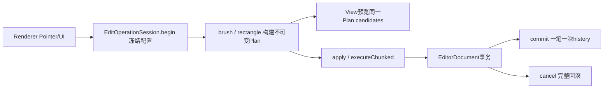

# TOOL-007-01 编辑操作基础设施：实施与验证

日期：2026-10-05。执行依据：[用户指定批准计划](TOOL-007-01-批准计划.md)。基线：本地与GitHub main均为 `6a25f0b3073e19c7bc27c812f7a16486aaf6a5dc`。范围仅007-01，不进入007-02。

## 实际改动

新增 `自制工具/map_editor/core/edit-operation.ts`，桌面接入仅修改 `desktop/renderer.ts`。没有修改既有Document/history实现、SceneSession、schema、公共库格式、发布清单、GLB/FBX、Blender脚本、Unity接收器或Gameplay。

- `buildBrushPlan`复用原`brushCandidates`；`buildRectanglePlan`固定1格采样并保留4096列/25万体素上限。Plan包括冻结配置、候选、执行分组、applied/noop/skipped统计、新增/移除估算和dirtyKeys。
- 地台重建可能删除高度区间以外的旧格，Plan显式列出这些变化；同色同owner不变格为noop，属性相同也为noop。预算预检纳入现有体素数量，先构建计划再修改。
- `EditOperationSession`只管理一笔操作的配置、seen、版本和分片状态；`EditorDocument`仍是唯一事务与历史拥有者。不存在第二套undo stack。
- 普通笔刷每个采样生成Plan，显示并执行同一个对象；连续采样共用事务。矩形缓存当前端点的Plan，端点不变时pointerup直接执行预览对象，不重算另一套候选。
- Rectangle每64个执行分组让出一帧，进度显示可取消。Esc/pointercancel/blur/异常统一取消，清预览、回滚并invalidate重建。旧异步分片或延迟异常不能取消或污染后续笔画。
- 替换模块/文档以及撤销、重做入口会取消未完成笔画。模块/场景历史继续隔离。

## 基础设施API与责任

独立纯构建入口为 `buildBrushPlan(editor, hit, config, seen?)`、`buildRectanglePlan(editor, start, end, config, seen?)`。操作会话使用 `begin(config) → brush/rectangle → apply(plan)或executeChunked(plan, chunkSize, yieldFrame, onProgress) → commit/cancel`。会话拒绝跨会话或过期计划；取消中的chunk返回false，调用方不应继续commit。主进程存储/WorkshopSession未提交源隔离沿用原实现。

## 行为差异与边界

原绘制模式、工具、键位、Root/PNG/剖切/颜色/场景装配保持原意。地台预览现在准确包含将删除的旧格；超预算尽量在Plan构建时提前报错，用户仍可取消整笔。连续笔画预算按当前采样预检，后续采样超预算由桌面取消整笔。

Fill和Legacy模型/贴花等非Brush路径仍使用已有编辑方法，由同一操作会话管理生命周期；未扩张为全功能Command Framework。本轮没有Worker调度、Clipboard、Stamp、创造模式或场景Brush。`data-operation-plan`是视口的只读坐标诊断输出，UI验证读取它并与磁盘实际数据比较，没有通过测试接口修改文档。

## 自动验证

工作目录：`自制工具/map_editor`。

- `pnpm exec tsc --noEmit`、`pnpm build`通过。
- `pnpm test`：196/196通过（原183＋新13）。覆盖预览实际坐标、地台移除/空操作、跨保护列、冻结配置、seen、整笔Undo、现有体素预算、异常回滚、三种取消、旧计划及旧异步异常。包含原WorkshopSession未提交笔画不污染AssetDocument测试。
- TDD先引入新API测试并确认缺少模块失败；桌面回放在旧实现下缺少Plan输出失败；延迟异步异常测试先失败后修正。证据保留 `validation/workshop-operation/core-red.log`；初始缺模块与首轮UI失败来自本次终端执行记录。
- `node tests/workshop-edit-operation-ui.mjs`：真实Electron新建项目/模块，9格笔刷预览坐标集合逐项等于磁盘；Ctrl+Z/Ctrl+Shift+Z；pointercancel、blur；矩形分片执行时Esc整笔恢复；重画完成986格并比对新增坐标集合；保存重开相同；pageerror为空。截图已实际查看。
- `workshop-protected-ui.mjs`：跨保护列两侧保留、桥洞不填死、整笔撤销、大笔画Esc/失焦取消；`workshop-module-ui.mjs`：选区另存、Root/PNG/模块生命周期；`workshop-assembly-ui.mjs`：装配回归。
- `m11-rectangle-ui.mjs`、`m12-brush-ui.mjs`、`m12-large-cancel-ui.mjs`通过；`workshop-ux-ui.mjs`四组通过，包括快捷键/输入保护、公共库、状态反馈及两尺寸四Workspace；`workshop-window-ui.mjs`通过。
- `workshop-workflow-ui.mjs`、`workshop-tomb-ui.mjs`、`workshop-publish-ui.mjs`、`workshop-binary-ui.mjs`通过。后两项旧测试首次因未切到“当前场景资产”标签而超时，补上标签选择后通过；没有修改发布产品代码。

证据目录：[workshop-operation](../../自制工具/map_editor/validation/workshop-operation/)。核心日志、UI结果JSON、截图、各回归日志与benchmark.json保存在该目录。已有部分测试会写其原证据目录，本轮不把这些生成文件混入源码范围。

## 性能记录

`node --experimental-strip-types tests/edit-operation-benchmark.ts`，Node v22.14.0，本机单次基准：

| 规模 | Plan构建 | Apply/分片总时长 | 体素 |
|---|---:|---:|---:|
| 1×1 | 0.28ms | 0.07ms | 1 |
| 17×17×4 | 2.07ms | 1.80ms | 1156 |
| 33×33×4 | 5.79ms | 3.87ms | 4356 |
| 4096列矩形 | 6.15ms | 981.79ms | 4096 |

矩形总时长包含64次让出调度（此Node基准使用timer，桌面使用requestAnimationFrame），不能与原同步循环的11.68ms直接比较为性能退化。记录用于复跑定位，不是硬FPS保证，也不是所有25万格形态的压力验收。

## 对007-02的影响与交接

没有发现必须改变已确认产品行为才能继续的阻塞。007-02可复用冻结配置、同源Plan与事务；新增六面/锁面/吸取规则时仍需补各自候选生成测试。当前Plan针对已有Brush/Rectangle，不承诺已经支持Clipboard或世界生成。大候选构建仍同步，生成器是否使用Worker留007-06。

本轮不声称新跑Blender/Unity；交换实现未改变，相关核心回归不代替实际引擎验证。未重新打包便携目录，开发运行入口使用本轮重新构建的Electron源码。用户长期使用手感尚未验收。完成007-01后停止；用户随后要求提交，按本地Git提交处理，未推送。未修改开发细则与用户维护区。提交时仓库已由其他任务推进到4f718e3，保留其提交及未提交改动。
